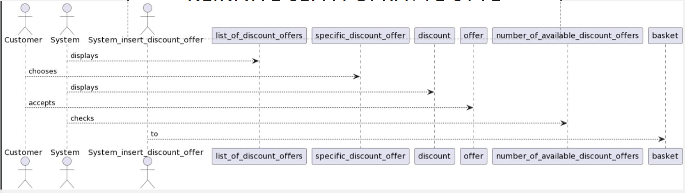

**Generovanie UML modelu z prípadov použitia** 
**Diplomová práca** 
**Autor: Bc. Filip Zaikner** 
**Školiteľ: Ing. Lukaš Radoský** 
  
**Anotácia:** 
Prípady použitia predstavujú skvelý nástroj pre komunikáciu medzi
zákazníkom, analytikom, a v konečnom dôsledku aj architektom či
programátorom. Umožňujú porozumieť procesom, ktoré bude daný informačný
systém či softvér podporovať. Než sú prípady použitia pretavené do finálneho
produktu v podobe zdrojového kódu, prechádzajú mnohými fázami, najmä
návrhom a implementáciou, často vo viacerých iteráciách. Vývoj softvéru
by bol značne rýchlejší a lacnejší, ak by bolo možné z prípadov použitia
automatizovane odvodiť štrukturálne alebo behaviorálne modely, ktoré vizuálne
reprezentujeme napríklad diagramom tried či diagramom sekvencií.
Analyzujte existujúce prístupy pre konverziu prípadov použitia na modely
bližšie zdrojovému kódu. Navrhnite a implementujte metódu pre konverziu
prípadov použitia na niektorý z týchto modelov. Umožnite vizualizáciu
vytvorených modelov. Svoju metódu a jej implementáciu overte na testovacej
množine dát.  
**Cieľ práce:** 
Vytvorte prototyp využívajúci novú alebo zdokonalenú existujúcu metódu
pre konverziu prípadov použitia na UML model. Vytvorený prototyp bude
poskytovať vizualizáciu vytvorených modelov vo forme diagramov. Overte
svoje riešenie pomocou množiny testovacích dát. 

**Denník:** 
28.2 - prezentácia podobných existujúcich riešení, článkov a návrh evaluácie 
14.3- základna prvá pipeline tokenizacia + lemma + OIE, 
28.3- úprava podla arch štýlu Chain of Responsibility, získanie use casov na evaluáciu. Návrh parametrizácie. Možnosť osekania času pre processing. 
14.4 - Dependency parsing + Part of speach, krokovani 
27.4 - Projektový slovník, Vykreslovanie UML, Prezentácia 
9.5 - Kostra latexu 

**Prezentácia:** V repozitári.
**PDF:** V repozitári.
**Kostra latexu:** V repozitári.

**Progress:** 
Pipeline je rozdelená na 3 časti. Každá časť spracováva Use Case inout metódou NLP. 
Ukážková veta: System displays a list of discount offers. 
 
Časť 1: Open Information Exctraction časť, ktorá dokáže rozdeliť vetu na predmet, prísudok a podmet. Kde podmet symbolizuje odosielateľa, predmet príjmateľa a prísudok správu.  
Výsledok :   System -->displays -->list    
Časť 2: Dependency parsing čast, ktorá rozdeľuje podľa vetných členov. Rovnako sa využíva podmet, predmet, prísudok ale na rozdiel od OIE aj iné vetné členy.  
Výsledok :   System-->displays-->list of discount offers.    
Časť 3: Part of speech reprezentuje najintuitívnejší spôsob. Veta sa rozdelí podľa slovných druhov. Ako prijmateľa a odosielateľa zvolíme podstatné mená, ako správu sloveso a využijeme aj iné rozvíjacie slovné druhy.  
Výsledok :  System-->displays-->list of discount offers.     

Ukážkový prípad použitia:     

1. System displays a list of discount offers.   
2. Customer chooses a specific discount offer.   
3. System displays the discount offer details.   
4. Customer accepts offer.   
5. System checks number of available discount offers.   
6. System inserts discount offer to basket.     

Výsledok Part of speech časti Pipeliny :  

